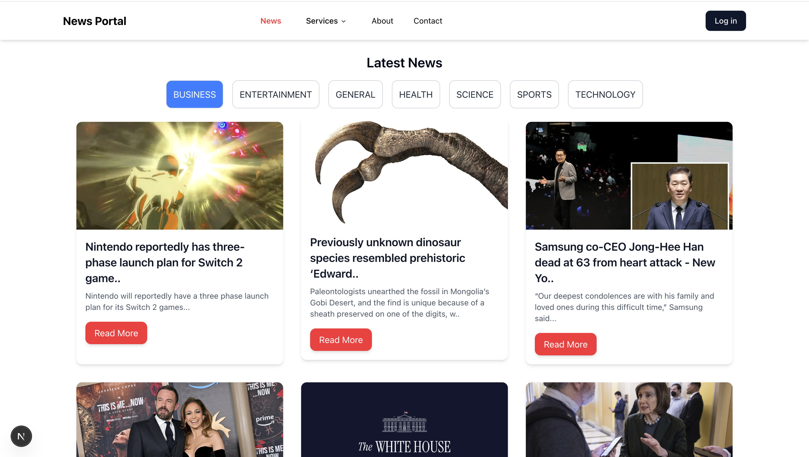
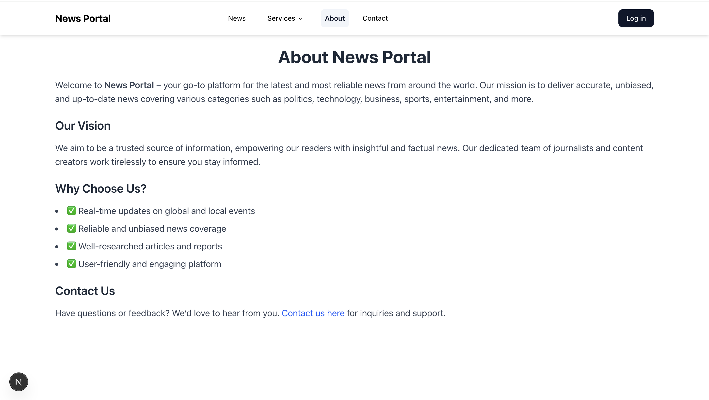
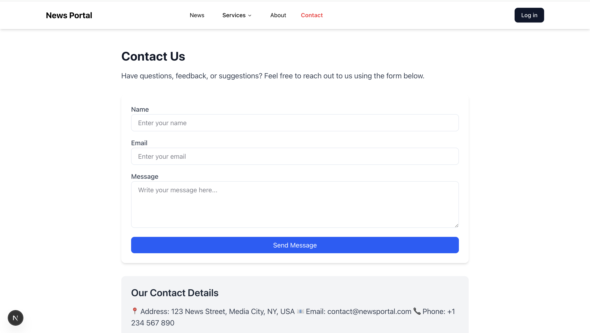

# News_Portal

## Overview
This is a **simple News application** built using **Next.js** that fetches and displays top news headlines from the [NewsAPI](https://newsapi.org/). Users can browse the latest news and click the **Read More** button to visit the full article on the original news website.

This project helped me learn:
- How **Next.js routing** works
- About **page layouts**
- The **basic file structure** in Next.js

## Website Preview

### Home Page


### About Page


### Contact Page



### 🚀 Getting Started  

#### **1. Install PNPM (if not installed)**  
Run the following command to install PNPM globally:  
```sh
npm install -g pnpm
```

#### **2. Create a New Next.js App**  
To create a new Next.js application using PNPM, run:  
```sh
pnpm create next-app@latest my-app
```
Replace `my-app` with your desired project name.

#### **3. Navigate to the Project Directory**  
```sh
cd my-app
```

#### **4. Start the Development Server**  
```sh
pnpm dev
```
This will start the Next.js application at `http://localhost:3000/`.


### 🎨 Setting Up `shadcn/ui`  

#### **1. Initialize `shadcn/ui`**  
Run the following command in your Next.js project directory:  
```sh
pnpm dlx shadcn@latest init
```


## API Used
This app fetches news from the **NewsAPI**:
```
https://newsapi.org/v2/top-headlines?country=us&apiKey=YOUR_API_KEY
```
Replace `YOUR_API_KEY` with your actual API key.


